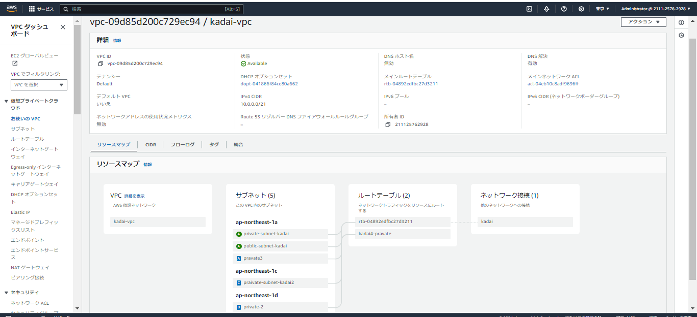
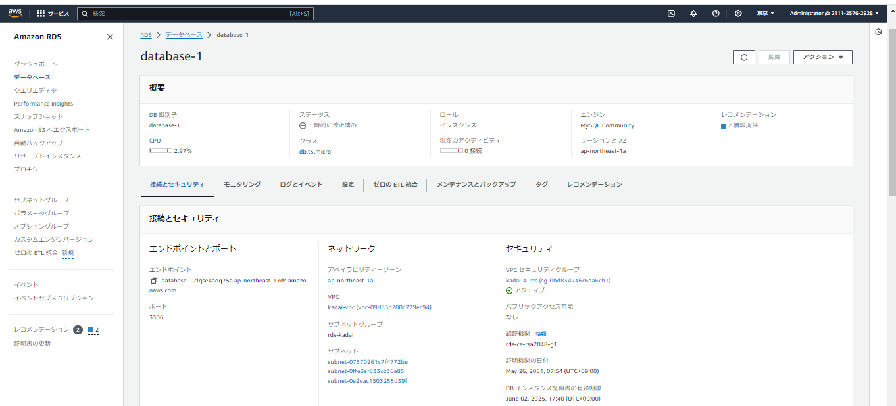

# 第四回課題　　

 
- VPC及びサブネットの構築

- EC2の作成  

  
 

- EC2のインバウンドルール  

  

- RDSの作成  

- RDSのインバウンドルール  

　　

- EC2からRDSの接続  

  

- #### 感想  
* どの順番でサービスを作成すれば効率よく構成できるかというところが難しかったです。
* エラーが発生した場合、仕組みを理解していないと修正するのに時間がかかるので気を付けないといけないと感じました。