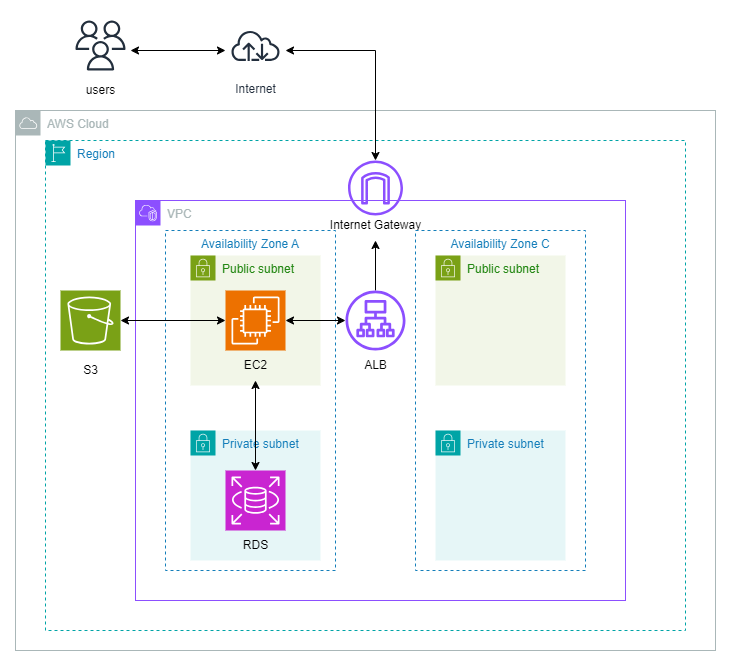

# 第10回課題
###  課題内容
- 第5回課題で構築した以下構成図をCloudFormationで構築する

###  作成したテンプレートファイル
- [VPC.yml](image/lecture10/VPC.yml)
- [EC2.yml](image/lecture10/EC2.yml)
- [ALB.yml](image/lecture10/ALB.yml)
- [RDS.yml](image/lecture10/RDS.yml)
- [S3.yml](image/lecture10/S3.yml)
  
###  CloudFormationのスタック作成結果

###  EC2からRDSへの接続確認

  
### 感想
- テンプレートを1つにまとめる場合と分ける場合それぞれ良さがあると思うのでどちらでも対応できるようにしていきたいと思います。
- 一度テンプレートを作成することが出来ればかなり時短になるので、CloudFormationは良いサービスだと感じました。